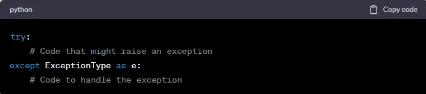

#### What is an Exception?

Exceptions is a term used for any abnormal or unexpected event happening. In python also, an exception is an abnormal or unexpected occurrence of an event occurred during program execution. Exceptions are a bad thing for a program as they disrupts the normal flow of the code and results in errors.

There are various reason an exception may occur during program execution, these are generally semantical or logical errors.

For example, an exception may occur when you are trying to open a file in read mode, when the file does not even exist. Some examples are:

* Invalid input
* File not found
* Division by zero
* Attempting to access a non-existent variable.

A smart way to handle such risks is to use the concept of exception handling, by writing the code in a try and except block.

